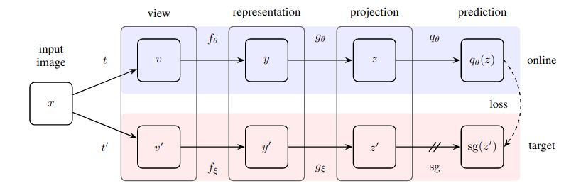
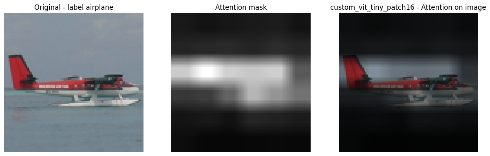
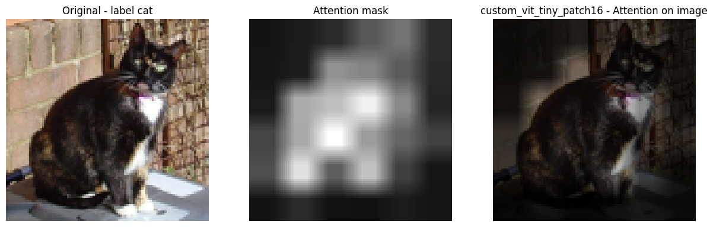
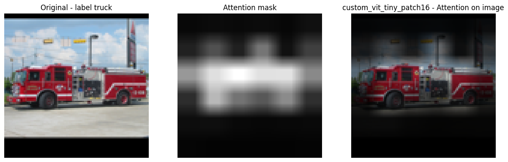

## **Self-Supervised Learning (BYOL+DINO) with PyTorch Lightning**
Pytorch-Lightning implementation of two of the most important self-supervised learning techniques: 

* **BYOL** ([`arXiv`](https://arxiv.org/pdf/2006.07733.pdf), [`repository`](https://github.com/deepmind/deepmind-research/tree/master/byol))
<p align="center">
    
</p>

* **DINO** ([`arXiv`](https://arxiv.org/pdf/2104.14294.pdf), [`repository`](https://github.com/facebookresearch/dino))
<p align="center">
    
</p>

## **Dataset**
Models are trained on the [STL10 dataset](https://ai.stanford.edu/~acoates/stl10/). The dataset was downloaded and then converted to *.png* images split into *train*, *test*, and *unlabelled* folders.

Train and test images must be divided into folders, every one representing a class.

## **Attention Maps and Weights**
Here some examples of attentions maps of ViT-tiny/16 (img size 96) trained with DINO for 300 epochs on STL10.

<p align="center">
    
</p>
<p align="center">
    
</p>
<p align="center">
    
</p>

<table>
  <tr>
    <th>arch</th>
    <th>img-size </th>
    <th>params</th>
    <th>linear</th>
    <th colspan="4">download</th>
  </tr>
  <tr>
    <td>ViT-tiny/16</td>
    <td>96</td>
    <td>5.5M</td>
    <td>73.3%</td>
    <td><a href="https://drive.google.com/file/d/1GGyE9ZAnjS0plGkIvxGKSUo9nNu5vlbB/view?usp=sharing">full DINO</a></td>
    <td><a href="https://drive.google.com/file/d/1XdP825Yqx-SJRRKU-Es0RGA6F45eXd3g/view?usp=sharing">linear model</a></td>
    <td><a href="https://drive.google.com/file/d/1cM3SgZJccEZmI5-ZNAh5UNsdsYCtRgBk/view?usp=sharing">DINO config</a></td>
    <td><a href="https://drive.google.com/file/d/1DIJacKW-IW_I7KqaK8gYCoKJcgoGmCIs/view?usp=sharing">linear config</a></td>
  </tr>
</table>


## **Train Self-Supervised Backbone**
The repository supports [timm](https://github.com/rwightman/pytorch-image-models) models as backbones for both BYOL and DINO. 

Both BYOL and DINO come with a YAML configuration file in *config/* folder. Play with it to change some training parameters such us backbones, augmentations, schedulers, etc.

To train the model with DINO, please run:
```
python train_ssl.py --config config/ssl/dino.yml --model dino --data-dir PATH/TO/STL10 --checkpoints-dir PATH/TO/DIR/TO/SAVE/PTH
```


## **Custom ViT**
Custom implementation of ViT is provided to be flexible on the image size. These the models supported:
* custom_vit_tiny_patch16
* custom_vit_small_patch16
* custom_vit_base_patch16

Image size will always be the one specified in the configuration file under the *transform* section. For all the other timm's models, please refer to its documentation to set the proper image input size.

## **Linear Evaluation**
Train a linear classifier on top of frozen features from self-sup backbone with *linear_eval.py* script.

```
python linear_eval.py --ssl-config PATH/TO/SSL/BACKBONE/CONFIG.yml --linear-config config/linear/config.yml --ssl-ckpt  PATH/TO/CKPT/SSL/BACKBONE --data-dir PATH/TO/STL10 --checkpoints-dir PATH/TO/DIR/TO/SAVE/PTH
```

## **Notebooks**
The folder *notebooks* contains the following notebooks:
* *visualize_attentions.ipynb* -> you can play with your custom ViT trained in SSL fashion to visualize the attentions for each image

## **MPS Support**
The repository has *mps* support to train on M1 GPUs. Remind to run the training script as follows:
```
PYTORCH_ENABLE_MPS_FALLBACK=1 python [SCRIPT].py
```

## **Warnings**
:warning: As of today most of timm's models works fine. Other models might fail.

## **TO-DOs**
[ ] Train new models (ViT-small / ViT-Base / ResNet18-50) on STL10

[ ] add warmup teacher temp


