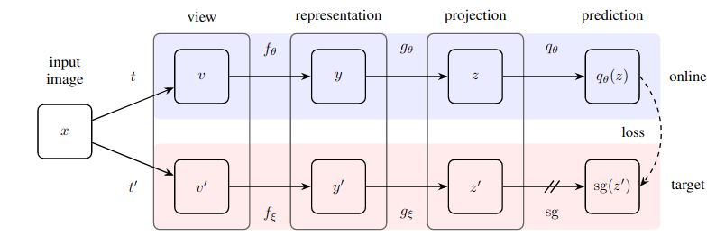

## **Self-Supervised Learning (BYOL+DINO) with PyTorch Lightning**
Pytorch-Lightning implementation of two of the most important self-supervised learning techniques: 

* **BYOL** ([`arXiv`](https://arxiv.org/pdf/2006.07733.pdf), [`repository`](https://github.com/deepmind/deepmind-research/tree/master/byol))
<p align="center">
    
</p>

* **DINO** ([`arXiv`](https://arxiv.org/pdf/2104.14294.pdf), [`repository`](https://github.com/facebookresearch/dino))
<p align="center">
    
</p>

## **Dataset**
Models are trained on the [STL10 dataset](https://ai.stanford.edu/~acoates/stl10/). The dataset was downloaded and then converted to *.png* images split into *train*, *test*, and *unlabelled* folders.

Train and test folders must be divided into folders, every one representing a class.

## **Train SSL**
The repository supports [timm](https://github.com/rwightman/pytorch-image-models) models as backbones for both BYOL and DINO. 

Both BYOL and DINO come with a YAML configuration file in *config/* folder. Play with it to change some training parameters such us backbones, augmentations, schedulers, etc.

To train the model, please run:
```
python train_ssl.py --config config/YOUR_CONFIG.yml --model dino/byol --data-dir PATH/TO/STL10 --checkpoints-dir PATH/TO/DIR/TO/SAVE/PTH
```

## **Custom ViT**
Custom implementation of ViT is provided to be flexible on the image size. These the models supported:
* custom_vit_tiny_patch16
* custom_vit_small_patch16
* custom_vit_base_patch16

Image size will always be the one specified in the configuration file under the *transform* section. For all the other timm's models, please refer to its documentation to set the proper image input size.

## **Notebooks**
The folder *notebooks* contains the following notebooks:
* *visualize_attentions.ipynb* -> you can play with your custom ViT trained in SSL fashion to visualize the attentions for each image
* *show_gradcam.ipynb* ->  after training a classifier on top of SSL-based weights, look at the GradCAM plots to see where the model focuses to predict a label
* *show_features_distribution* -> either before or after look at the features distribution per class extracted from the model trained with SSL fashion with a t-SNE plot

## **MPS Support**
The repository has *mps* support to train on M1 GPUs. Remind to launch the training script as follows:
```
PYTORCH_ENABLE_MPS_FALLBACK=1 python train.py
```


 

## **Warnings**
:warning: As of today most of timm's models works fine. Other models might fail.

## **TO-DOs**
[ ] Add models performances on STL10

[ ] Add download link in notebooks for weights+yml

[ ] Add notebook to train a classifier on DINO/BYOL weigths


